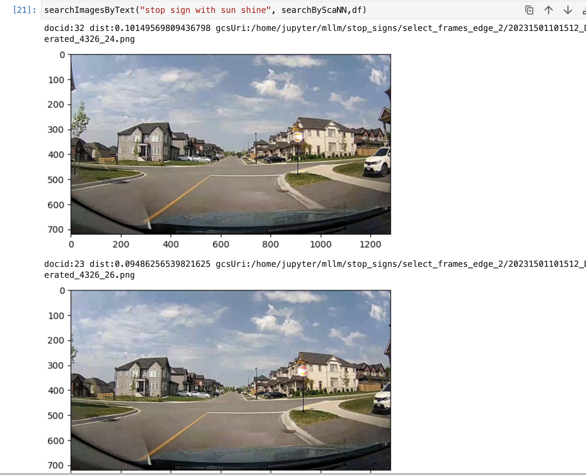
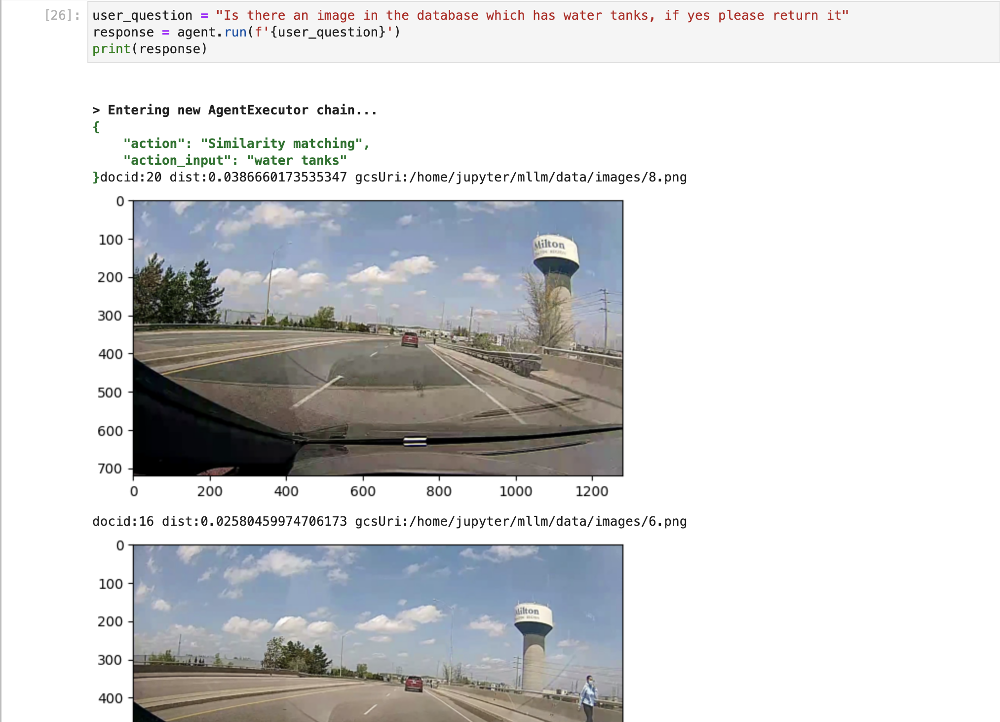

# Smart-data-retrieval-with-multi-modal-embeddings
## Text-to-image search and Image-to-image search
### Using CoCa multi-modal embeddings we convert the images in our database and store them on a vectorDB, the user can then query using Natural language to find interesting cases for 1. Creating Evaluation datasets, 2. Find insights about existing data

# Some examples below

## Building a LangChain based agent that can retreive based on embeddings

